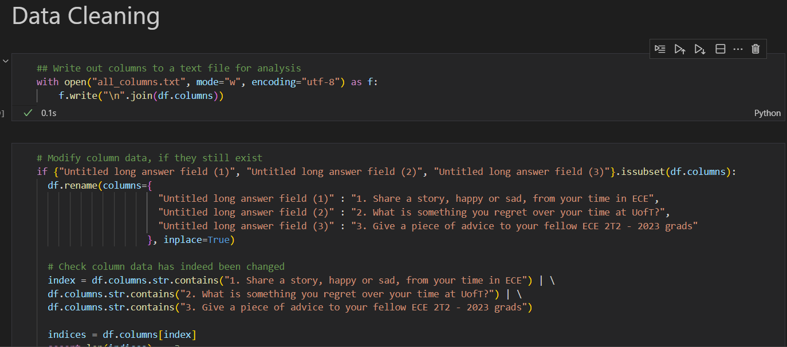

# Fourth Year Opinions
Survey results from 52 ECE2T3 4th-Year UofT Students.

## Install Dependencies
Before installing dependencies from the following command, create a virtual environment and install
requirements.txt to commence development
```
pip install -r requirements.txt
```

## Helper Files for Data Analysis Reference
**nulls.txt**: Describes the number of null values for a column. In the format of <*column_name*> : <*number_of_null_values*> <br>
**all_columns.txt**: Names of columns


## Jupyter Notebook to HTML Conversion
Notebook to HTML conversion can be done by running the script jupyter_to_html.sh, using the following command
```
bash jupyter_to_html.sh
```

All code cell INPUTS are automatically hidden by the output html. For example: you will not see Data Cleaning section
of the notebook in the output.


To ignore a cell completely from output html, add a cell tag "hide_code" to a cell (See Example Below, where I assign hide_code
to Data Cleaning markdown because I don't want it in the HTML Output, only for personal reference)


## Notebook Style Configuration
CSS can be configured by changing html_template/static/index.css and html_template/static/index.html.j2.
For more info on template customization, see here: https://nbconvert.readthedocs.io/en/5.5.0/customizing.html
and https://nbconvert.readthedocs.io/en/latest/customizing.html