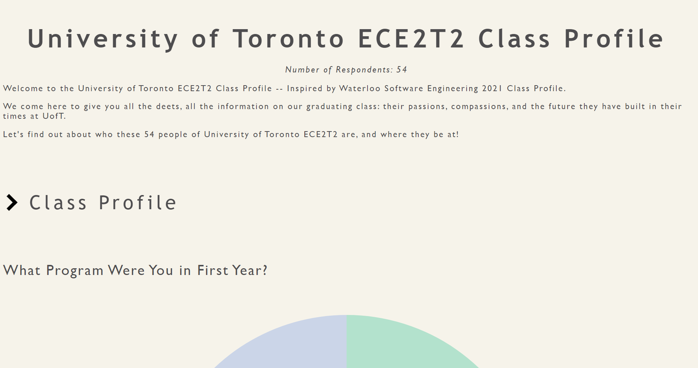
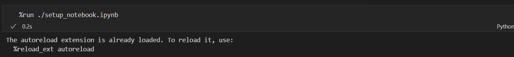
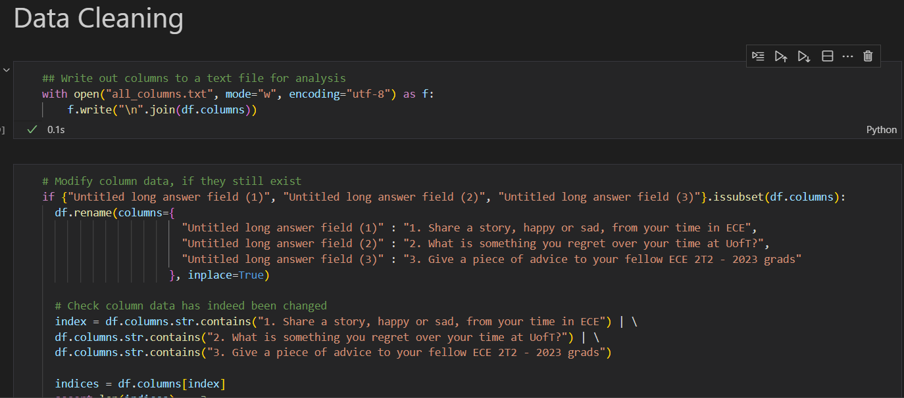
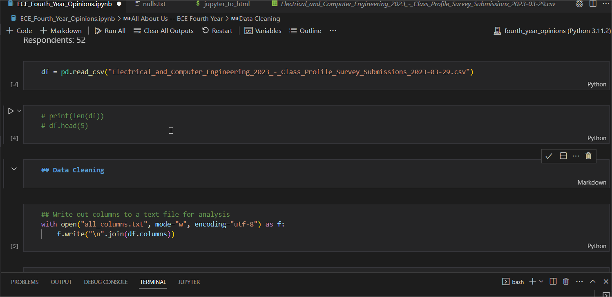
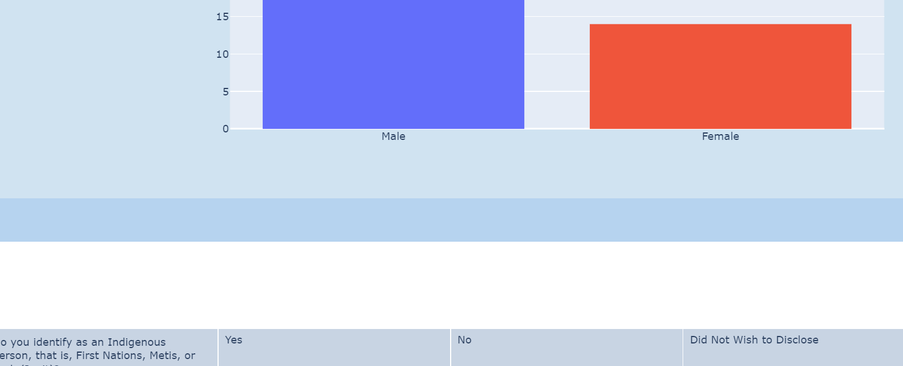

# Fourth Year Opinions
Survey responses from 54 ECE2T2 UofT Students graduating in 2023.

Check out the results here!!: https://hamsburger.github.io/ECE2T2_Survey_Results/

 <image src="tutorial_images/class_profile_bar_chart.png">

## Install Dependencies
Before installing dependencies from the following command, create a virtual environment and install
requirements.txt to commence development. Do **NOT** use Python 3.11 for your virtual env, use **Python 3.10**.
```
pip install -r requirements.txt
```

## Collaborating with Others:
### When you want to work on visualizing a question (for example, plot a bar chart What Is Your Gender?), assign yourself to that column through this spreadsheet so we don't duplicate work:
https://docs.google.com/spreadsheets/d/1Er5QhbmRjqlDy8VP3qVs7yf_IEnPd11_SMl5wWqZkYc/edit#gid=0.
For people in the future working on this survey, use a similar spreadsheet to the one above for collaboration
<br>
<br>

## Getting Started with Development
Don't worry, plotly development has a low learning-curve! You can also refer to some of the **CODE and HELPER FUNCTIONS** I've already written in **ECE_Fourth_Year_Opinions.ipynb** and **setup_notebook.ipynb** to get a feel for how to use them to easily explore data, clean data, and generate different types of visualizations including tables, charts, and even word maps.

Skim both .ipynb notebooks to get an idea of what's possible in Plotly!
<br>
<br>

## Jupyter Notebook to HTML Conversion
Notebook to HTML conversion can be done by running the script jupyter_to_html.sh, using the following command. This command will **RUN THE ENTIRE NOTEBOOK**
and then generate an output
```
bash jupyter_to_html.sh
```

**WARNING:** If the script does not run successfully, you may have to run the first code cell manually, then run the bash script because the notebook to HTML converter sometimes does not execute magic cell command (commands prefixed with % or %%) present in the first cell


If you do not wish the run the entire notebook and only want to generate output HTML based on the current state of the Jupyter Notebook (based on the visualizations you have generated so far), you can run this command. 
```
bash jupyter_to_html_any_no_execution.sh <name_of_notebook>
```

### Hiding Code Cell inputs in Output HTML
All code cell INPUTS are automatically hidden by the output html. For example, in the output html, you will not see any code cells
under the Data Cleaning section header of the Jupyter Notebook


### Hidinng Markdown Cells or Cell Output
There may also be cases where you want to hide Markdown Cells or Cell Output. To do so, add a cell tag "hide_code" to a cell/cell output which you want to hide (In the below example, I assign hide_code to the Data Cleaning markdown because I don't want it in the HTML Output. The cell is used for personal reference)


### Removing bottom margins
Every cell output has natural bottom margins. To remove bottom margins from a cell output, add a cell tag "no_margin" to the cell containing the output.
<p align="center">
  
&nbsp; &nbsp; &nbsp; &nbsp;
  
</p>
<br>
<br>

# Helper Files for Data Analysis Reference
**all_columns.txt**: Names of columns

## Notebook Style Configuration
CSS can be configured by changing html_template/static/index.css and html_template/static/index.html.j2.
For more info on template customization, see here: https://nbconvert.readthedocs.io/en/5.5.0/customizing.html
and https://nbconvert.readthedocs.io/en/latest/customizing.html

## Plot Style Configuration
Plotly is used for making visualizations in this project. For more on how to use Plotly, read the docs: https://plotly.com/python/getting-started/
and also refer to the notebooks **ECE_Fourth_Year_Opinions.ipynb** and **setup_notebook.ipynb** to learn about how visualizations are
configured and produced.

## Other Concerns
If the output of *pip freeze > requirements.txt* looks weird and contains 
references to local files (For example, Werzkurg @ "file://mydirectory/myinnerdirectory/werzkurg.bin").
Use this command to store requirements.txt instead.
```
pip list --format=freeze requirements.txt
```
