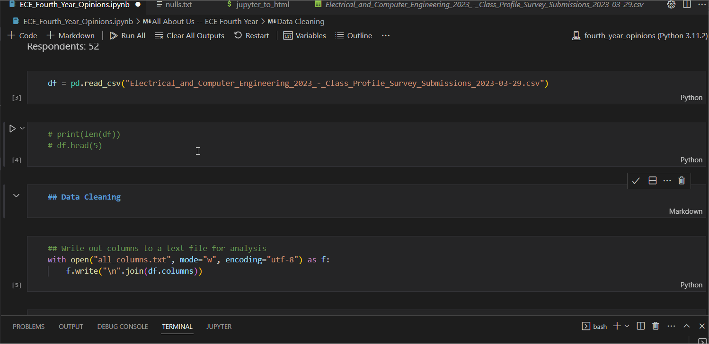

# Fourth Year Opinions
Survey results from 52 ECE2T3 4th-Year UofT Students.


## Install Dependencies
Before installing dependencies from the following command, create a virtual environment.
```
pip install -r requirements.txt
```

## Helper Files for Data Analysis Reference
**nulls.txt**: Describes the number of null values for a column. In the format of <*column_name*> : <*number_of_null_values*> <br>
**all_columns.txt**: Names of columns

## Jupyter Notebook to HTML Conversion
Notebook to HTML conversion can be done by running the script jupyter_to_html.

All inputs are automatically hidden by the output html.

To ignore a cell completely from output html, add a cell tag "hide_code" to a cell (See Example Below, where I assign hide_code
to Data Cleaning markdown because I don't want it in the HTML Output, only for personal reference)



